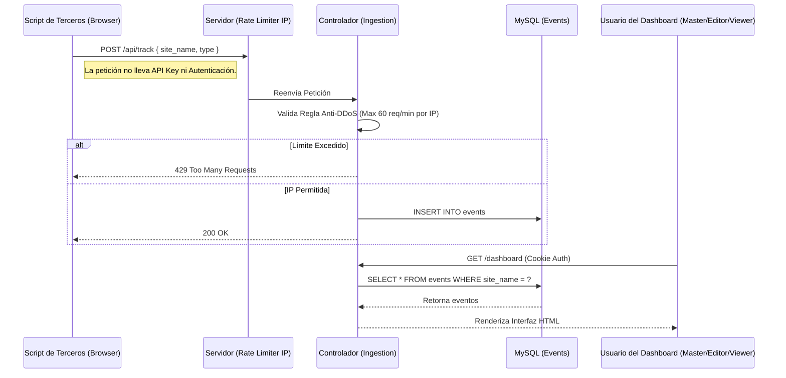
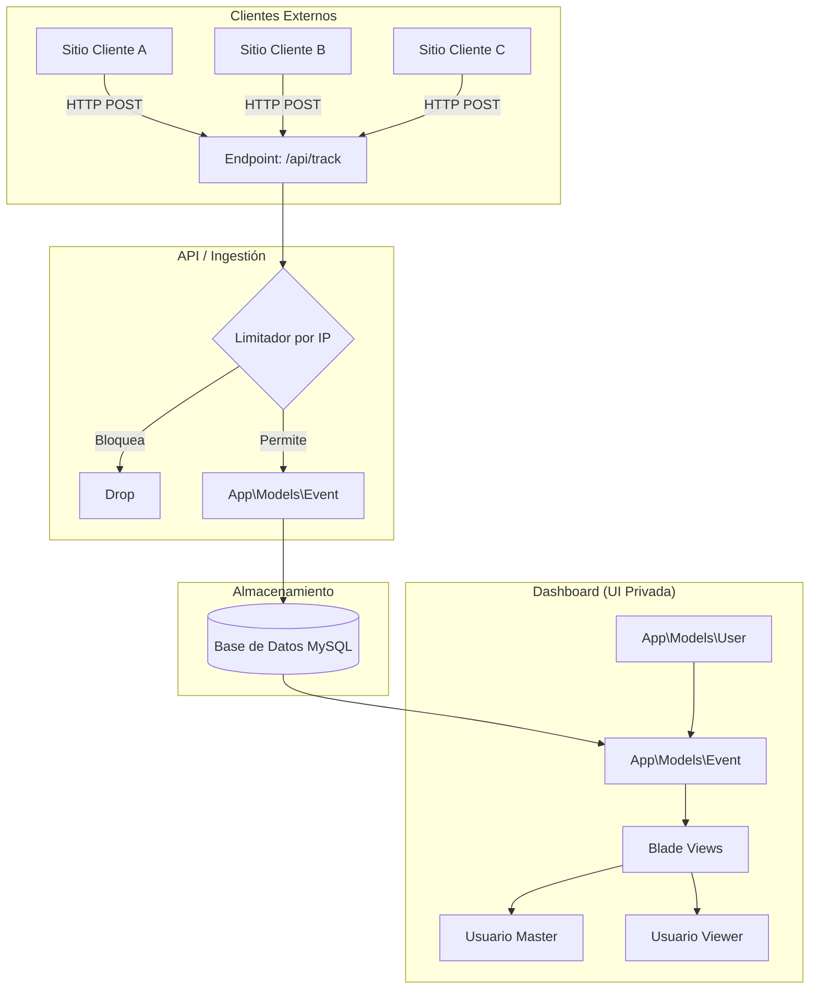

# Arquitectura y Flujo de Datos

El sistema sigue una arquitectura cliente-servidor ultra simple, sin middleware de autenticación en la capa de ingestión.

## Diagrama de Flujo (Ingestión y Consumo)

A continuación, un diagrama que explica cómo un sitio de terceros se comunica con nuestro Dashboard, y cómo los usuarios consumen la información.

## Arquitectura Lógica

## Anti-DDoS y Limitación de Tasa (Rate Limiting)

Para evitar que se llene la base de datos de basura (ya que el endpoint es público), implementamos una estrategia de **Limitación por IP**.
Si una misma IP de usuario (proveniente del navegador del cliente, o inyectada por el servidor del cliente) envía más de **60 eventos en 1 minuto**, el servidor de analíticas denegará las peticiones subsiguientes hasta que pase el período de gracia.
