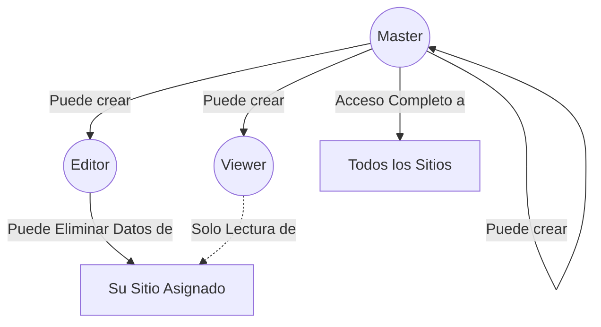

# Autenticación y Roles

El sistema utiliza la autenticación de sesión nativa de Laravel (cookies) exclusiva para acceder al Dashboard administrativo. **No se utiliza ninguna autenticación para la ingesta de datos en `/api/track`**.

## Arquitectura de Control de Acceso (RBAC)

La plataforma maneja 3 niveles de roles jerárquicos:

## Definición de Roles

| Rol      | Lectura de Datos | Eliminación de Datos | Gestión de Usuarios | Restricción de Sitio |
| :---     | :---             | :---                 | :---                | :---                 |
| **Master** | Todos los sitios | Sí, todos los sitios | Sí (Crea Master, Editor, Viewer) | Ninguna |
| **Editor** | Solo su sitio asignado | Sí, solo los de su sitio | No | `site_name` |
| **Viewer** | Solo su sitio asignado | No | No | `site_name` |

### Notas de Implementación

1. **Gestión de Basura / Spam:** Dado que la ingestión es pública, un atacante o bot podría intentar enviar eventos a un sitio (ej. enviando pageviews falsos). Para gestionar esto sin añadir complejidad técnica al recolector, el **Editor** o el **Master** pueden simplemente entrar al dashboard y usar el botón **"Borrar Datos del Sitio"** para limpiar todo el registro del sitio afectado e iniciar desde cero.
2. **Asignación de Sitios:** Al crear un *Editor* o un *Viewer*, el *Master* debe escribir manualmente el `site_name` exacto (el mismo string que el frontend envía vía HTTP) al que dicho usuario tendrá acceso. 

## Control de Pagos y Suscripciones (Stripe)

El sistema cuenta con un muro de pago (Paywall) integrado con Stripe para usuarios con rol `Editor` y `Viewer`:

- **Activación / Desactivación Global:** Se controla mediante la variable de entorno `STRIPE_PAYMENTS_ENABLED` en el archivo `.env`:
  - `STRIPE_PAYMENTS_ENABLED=true`: Activa el flujo de suscripción y prueba gratuita. Los usuarios no administradores deben tener suscripción activa tras su periodo de prueba.
  - `STRIPE_PAYMENTS_ENABLED=false`: Desactiva completamente los cobros. Todos los usuarios (Master, Editor y Viewer) tienen acceso libre y directo al dashboard sin pasar por la pasarela de Stripe.
- **Configuración Dinámica:** El rol `Master` también puede activar o desactivar los cobros y actualizar montos/claves directamente desde la sección **Cobros Stripe (08)** en el dashboard.

## Usuario Inicial por Defecto

El archivo `db_structure.sql` genera el siguiente usuario `Master` en la instalación base para garantizar acceso:

- **Email:** `admin@admin.com`
- **Password:** `password`
