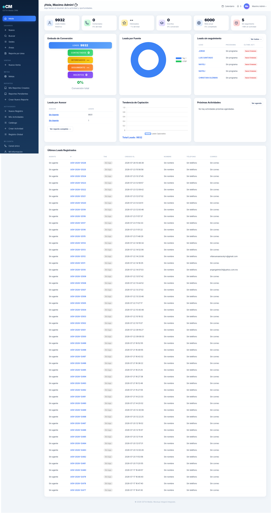
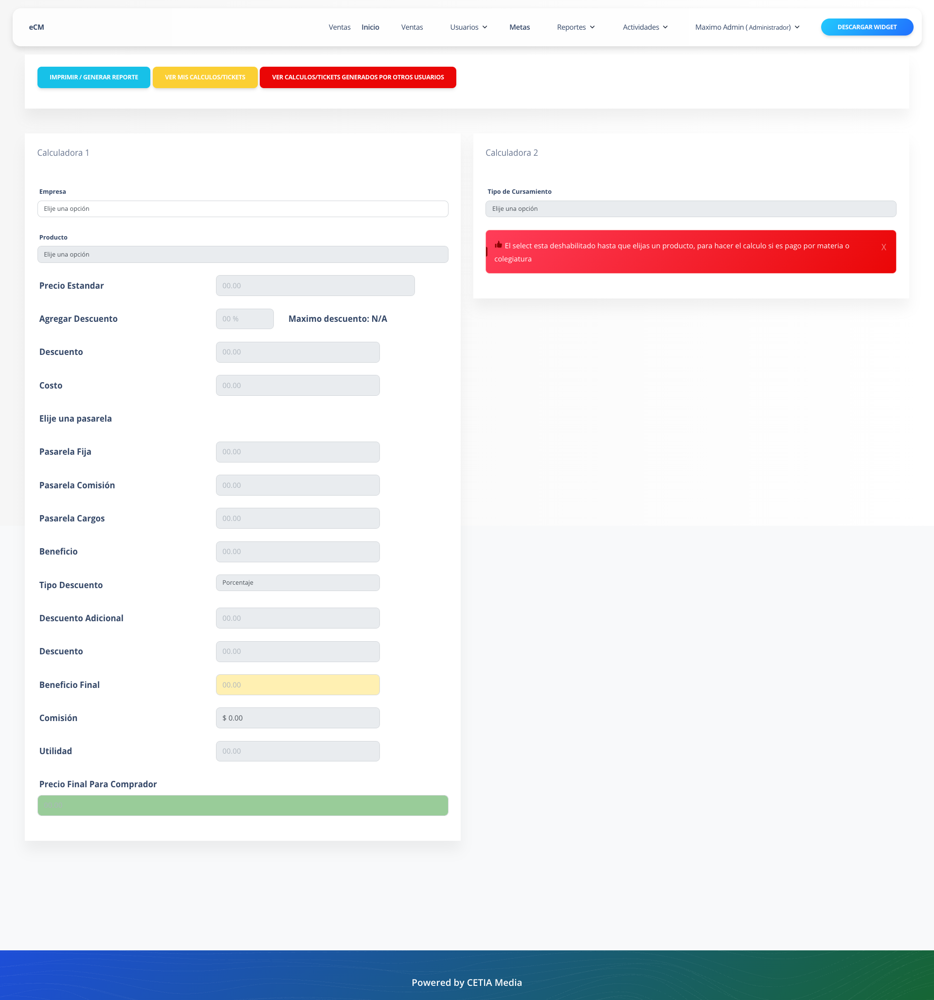
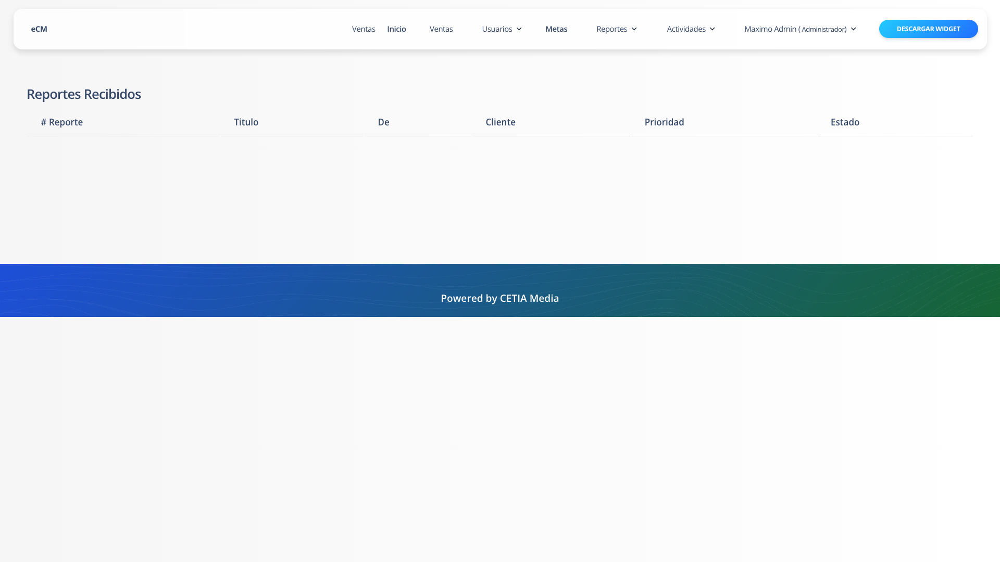

# Documentación de Funciones del Sistema CRM

Este documento describe todas las funcionalidades y módulos integrados en el sistema (excluyendo el widget de captación de leads), e incluye evidencias visuales de los módulos principales.

## 1. Gestión de Clientes (CRM) y Ventas
El núcleo del sistema para el seguimiento de prospectos y ventas.
* **Registro de Prospectos:** Captación de clientes desde múltiples fuentes (Formularios web, registros de emergencias, integraciones).
* **Asignación de Leads:** Herramientas para asignar clientes nuevos a agentes de ventas específicos (`/api/setcliente`).
* **Gestión de Cartera:** Administración de la cartera de clientes, permitiendo ver clientes inscritos, reasignar o eliminar prospectos de la vista de ventas.
* **Seguimiento (Agenda/Bandeja):** Control del seguimiento diario con los clientes.
* **Metas de Ventas:** Establecimiento, visualización y seguimiento de metas por usuario o departamento.

## 2. Omnicanalidad y Comunicaciones
Integración de canales de comunicación directa con el cliente desde la plataforma.
* **Softphone AWS:** Integración de telefonía para realizar y recibir llamadas directamente desde el sistema.
* **Centro Omnicanal:** Consola unificada para interactuar con los clientes a través de diversos medios.
* **SMS y Webhooks:** Envío de mensajes de texto mediante proveedores externos (Altiria) y recepción de eventos (ej. Facebook).
* **Correos Electrónicos:** Módulo interno para la composición, envío y recepción de correos.

## 3. Pagos, Finanzas y Suscripciones
Gestión del flujo de ingresos, cobros y métodos de pago.
* **Pasarelas de Pago:** Integración de cobros mediante **Stripe** y **PayPal**.
* **Cartera y Cobranza:** Seguimiento a los pagos de los clientes, adeudos, créditos y suscripciones activas.
* **Control de Finanzas:** Registro de cobros, tarjetas y transacciones generales del CRM.

## 4. Calculadora y Cotizaciones
Herramienta para generar proyecciones y costos para los clientes.
* **Módulo de Calculadora:** Interfaz para cotizar.
* **Gestión de Datos:** Recolección de "Mis Datos" y "Datos Generales" para personalizar la cotización.
* **Catálogos Dinámicos:** La calculadora se alimenta de información en tiempo real sobre Empresas, Pasarelas, Productos y Materias.
* **Historial:** Guardado y consulta de registros/cotizaciones generadas.

## 5. Gestión de Catálogos (Operaciones)
Módulos de administración de los recursos, productos y estructura de la organización.
* **Empresas:** CRUD de empresas y asignación de productos a las mismas.
* **Productos:** Administración del catálogo general de productos o servicios ofrecidos.
* **Materias y Categorías:** Agrupación y clasificación de la oferta educativa o de servicios.
* **Estructura Física:** Control de sedes, sucursales y franquiciatarios.
* **Insumos:** Control de formatos, papelería y documentos internos.

## 6. Actividades y Productividad
Control del trabajo diario del personal.
* **Registro de Actividades:** Creación y seguimiento de actividades por usuario.
* **Vistas de Agenda:** Filtros para ver actividades por fecha, por usuario específico, o vista global de todo el equipo.
* **Catálogo de Actividades:** Configuración de los diferentes "tipos" de actividades que el equipo puede realizar.

## 7. Soporte y Atención (Tickets)
Módulo para la resolución de incidencias, dudas o quejas.
* **Sistema de Reportes (Tickets):** Creación de tickets de soporte.
* **Bandejas de Tickets:** Vista de "Mis reportes" y lista general de reportes.
* **Seguimiento:** Sistema de respuestas y conversación dentro de cada ticket, con soporte para subir archivos.
* **Asignación:** Capacidad de dirigir el reporte a un área o usuario específico.
* **Quejas y Encuestas:** Retroalimentación sobre el servicio proporcionado.

## 8. Administración de Usuarios y Recursos Humanos
Control de acceso y gestión del personal.
* **Empleados y Usuarios:** Alta, baja y modificación de perfiles.
* **Roles y Permisos:** Control de acceso basado en el nivel del usuario.
* **Perfiles Personalizados:** Edición de información propia del usuario.

## 9. Portal de Alumnos y Contenido Documental
Interacción directa con los servicios educativos proporcionados.
* **Gaceta:** Sistema de publicaciones, noticias o comunicados.
* **Material Audiovisual:** Visualización de videos y firmas de videos.
* **Gestión Documental:** Repositorio y visualización de documentos en la nube.
