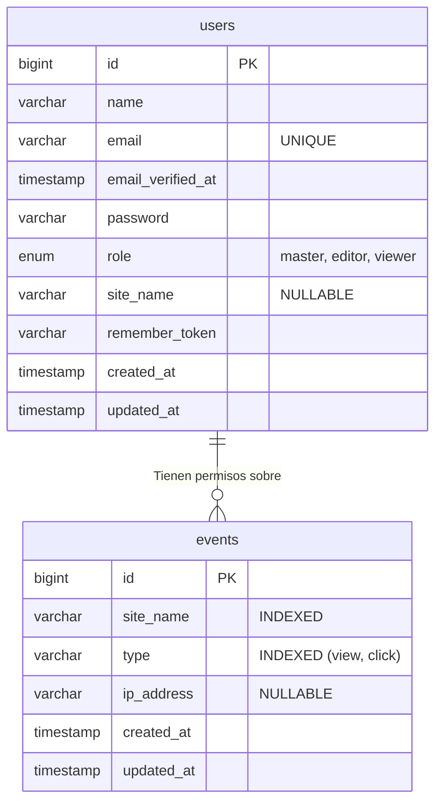

# Estructura de la Base de Datos

El sistema utiliza una base de datos MySQL relacional con una estructura ultra-plana intencional. No dependemos de llaves foráneas complejas para garantizar la velocidad de inserción y evitar errores de integridad cuando se elimina o archiva información.

## Diagrama Entidad-Relación (ERD)

## Detalles de las Tablas

### `events`
Es la tabla más pesada del sistema, diseñada para escritura masiva.
- **Índices**: Tiene índices dedicados en `site_name` y `type` para permitir agrupaciones (COUNT) y filtrados súper rápidos en el Dashboard.
- **Acoplamiento Débil**: No tiene relación estricta en base de datos con `users`. Los eventos de un sitio existen independientemente de si hay un usuario asignado a verlos.

### `users`
Almacena los accesos administrativos del Dashboard.
- El campo `site_name` define a qué identificador tiene acceso dicho usuario.
- Si un usuario tiene `site_name = null` y su `role = master`, entonces el sistema a nivel de código le otorga acceso global a la tabla de `events`.
